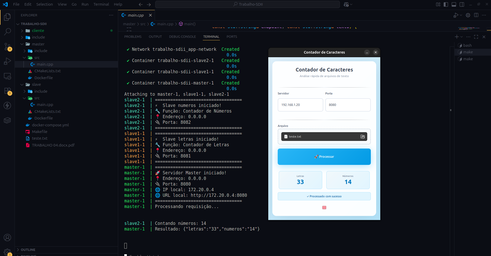

# 📊 Sistema Distribuído de Contagem de Caracteres

Um sistema distribuído desenvolvido em C++ que conta letras e números em arquivos de texto usando arquitetura Master-Slave com interface gráfica GTK.



## 🏗️ Arquitetura

O sistema é composto por três componentes principais:

- **Master**: Servidor principal que recebe requisições HTTP na porta 8080 e coordena o trabalho
- **Slave 1**: Servidor especializado em contar letras (porta 8081)  
- **Slave 2**: Servidor especializado em contar números (porta 8082)
- **Cliente GTK**: Interface gráfica para interação com o usuário

## 🔧 Tecnologias Utilizadas

- **C++17**: Linguagem principal
- **GTK3**: Interface gráfica do cliente
- **httplib**: Biblioteca HTTP para comunicação entre serviços
- **nlohmann/json**: Manipulação de JSON
- **Docker & Docker Compose**: Containerização e orquestração
- **CMAKE**: Sistema de build

## 📋 Pré-requisitos

### Para execução com Docker (recomendado):
```bash
sudo apt-get install docker docker-compose
```

### Para desenvolvimento local:
```bash
sudo apt-get install build-essential cmake pkg-config libgtk-3-dev wget
```

## 🚀 Como Executar

### 1. Executar o Sistema Completo (Docker)

```bash
# Clone o repositório
git clone <seu-repositorio>
cd <nome-do-projeto>

# Configurar e iniciar os servidores
make run
```

### 2. Executar o Cliente GTK

**Opção A: Cliente local (recomendado)**
```bash
# Compilar e executar cliente GTK localmente
make run-client
```

**Opção B: Cliente com Docker (requer X11 forwarding)**
```bash
# Permitir acesso ao X11 (apenas Linux)
xhost +local:docker

# Executar cliente containerizado
make run-client-docker
```

### 3. Comandos Úteis

```bash
# Limpar e reconstruir tudo
make clean
make all

# Parar os serviços
make stop

# Ver logs dos containers
docker-compose logs -f
```

## 🎯 Como Usar

1. **Inicie os servidores**: Execute `make run` para subir Master e Slaves
2. **Abra o cliente**: Execute `make run-client` para abrir a interface gráfica
3. **Configure a conexão**:
   - IP do servidor: `localhost` ou IP do host onde roda o Master
   - Porta: `8080` (porta padrão do Master)
4. **Selecione um arquivo**: Clique em "Escolher arquivo" e selecione um arquivo de texto
5. **Processe**: Clique em "🚀 Processar Arquivo" para enviar ao servidor

## ⚙️ Como Funciona

### Fluxo de Processamento

1. **Cliente GTK** envia arquivo via HTTP POST para o **Master** (porta 8080)
2. **Master** verifica se os **Slaves** estão saudáveis (health check)
3. **Master** divide o trabalho:
   - Envia conteúdo para **Slave 1** contar letras (porta 8081)
   - Envia conteúdo para **Slave 2** contar números (porta 8082)
4. **Slaves** processam em paralelo usando `std::async`
5. **Master** consolida resultados em JSON e retorna para o cliente
6. **Cliente** exibe os resultados na interface

### Comunicação

```
Cliente GTK  →  Master (8080)  →  Slave1 (8081) [letras]
                    ↓         →  Slave2 (8082) [números]
                    ↓
                 Resultado JSON  →  Cliente GTK
```

### Exemplo de Resposta JSON

```json
{
  "letras": "25",
  "numeros": "19"
}
```

## 📁 Estrutura do Projeto

```
.
├── cliente/
│   ├── src/main.cpp          # Interface GTK
│   ├── CMakeLists.txt        # Build do cliente
│   └── Dockerfile            # Container do cliente
├── master/
│   ├── src/main.cpp          # Servidor coordenador
│   ├── CMakeLists.txt        # Build do master
│   └── Dockerfile            # Container do master
├── slave/
│   ├── src/main.cpp          # Servidores workers
│   ├── CMakeLists.txt        # Build do slave
│   └── Dockerfile            # Container do slave
├── docker-compose.yml        # Orquestração dos containers
├── Makefile                  # Automação de comandos
├── teste.txt                 # Arquivo de exemplo
└── printscreen/
    └── foto1.png            # Screenshot da aplicação
```

## 🔍 Endpoints da API

### Master (porta 8080)
- `POST /processar` - Processa arquivo de texto e retorna contagens

### Slaves (portas 8081, 8082)
- `GET /health` - Verifica se o serviço está funcionando
- `POST /letras` - Conta letras no texto (apenas Slave 1)
- `POST /numeros` - Conta números no texto (apenas Slave 2)

## 🐛 Troubleshooting

### Problema: Cliente GTK não abre
**Solução**: Certifique-se que tem GTK3 instalado:
```bash
sudo apt-get install libgtk-3-dev
```

### Problema: Erro de conexão
**Solução**: Verifique se os servidores estão rodando:
```bash
docker-compose ps
curl http://localhost:8080/health  # Deve retornar erro 404 (normal, endpoint não existe)
```

### Problema: X11 forwarding não funciona
**Solução**: Use o cliente local:
```bash
make run-client
```

## 🧪 Testando

Execute com o arquivo de exemplo:
```bash
# O arquivo teste.txt contém: "abcdefghidfdfdfdjklmnopqrstuvwyxz12345678944444"
# Resultado esperado: 29 letras, 16 números
```

## 🔧 Desenvolvimento

### Compilar apenas um componente:
```bash
# Apenas cliente
make build-client-local

# Apenas setup de dependências
make setup-client setup-master setup-slave
```

### Estrutura das dependências:
- `httplib.h`: Biblioteca HTTP header-only
- `nlohmann/json.hpp`: Parser JSON header-only
- Todas baixadas automaticamente pelo Makefile

## 📝 Licença

Este projeto foi desenvolvido para fins educacionais demonstrando arquitetura distribuída com C++, Docker e GTK.

## 🤝 Contribuições

Para contribuir:
1. Faça fork do projeto
2. Crie uma branch para sua feature
3. Commit suas mudanças
4. Faça push para a branch
5. Abra um Pull Request